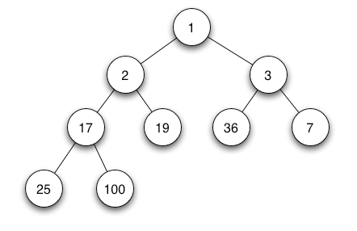
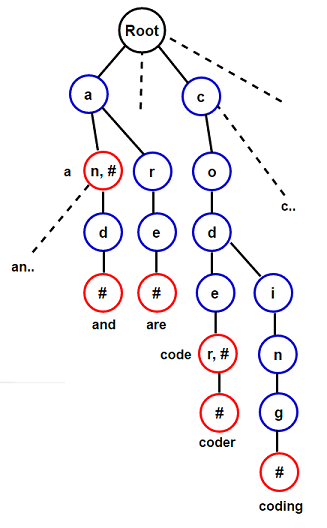
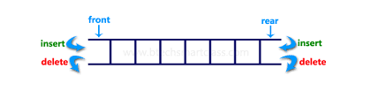
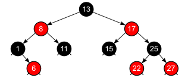

# Data Structures
This repo contains my personal Python implementation of more complex, non trivial data structures.

## Heap
It is commonly used to implement priority queues, which are data structures that allow efficient retrieval of the maximum (or minimum) element.
In a binary heap, the heap property states that for any given node i, the value of the parent node is greater (or smaller) than or equal to the values of its child nodes. This property ensures that the maximum (or minimum) element is always at the root of the heap.
Heaps have efficient operations for insertion, deletion, and retrieval of the maximum (or minimum) element. These operations typically have logarithmic time complexity, making heaps suitable for various applications such as sorting, graph algorithms, and scheduling.

  

    In our implementation, the Heap object features the following methods:  

- push(val): Add the input value val to the heap --- O(logN)                    
- pull(): Get and remove the top element from the heap --- O(logN)
- peek(): Get the top element of the heap --- O(1)

## Trie 

A trie, also known as a prefix tree or digital tree, is a tree-based data structure used for efficient retrieval and storage of strings or sequences of characters. It is particularly useful for applications involving dictionary or prefix-based searching. 
In a trie, each node represents a single character or a part of a string. The root of the trie represents an empty string, and each child node represents a character that extends the current string. The edges of the trie are labeled with characters, and the paths from the root to the leaf nodes represent complete strings. 
One key feature of a trie is its ability to store and retrieve strings with a time complexity proportional to the length of the string, regardless of the number of strings stored in the trie. This makes tries efficient for tasks like string search, autocomplete, and dictionary lookup.

  

In our implementation, the Trie object features the following methods:

- add_word(word): Add word to the Trie --- O(len(word))
- search_word(word): Return True if word is in the Trie --- O(len(word))
- search_prefix(prefix): Return True if prefix is in the Trie --- O(len(prefix))

## Deque

A deque, short for "double-ended queue," is a data structure that allows elements to be inserted and removed from both ends. It combines the properties of a stack (Last-In-First-Out) and a queue (First-In-First-Out), providing efficient insertion and removal operations at both ends.

In a deque, elements can be added or removed from the front (left side) or the back (right side) of the deque. This flexibility makes it useful for scenarios where you need to efficiently add or remove elements from either end, such as managing a sliding window of elements or implementing algorithms like breadth-first search.

In our implementation, the Deque object is implemented as a Linked List, featuring the following methods:

- append_right(val): Add an element to the end of the queue --- O(1)
- append_left(val): Add an element to the front of the queue --- O(1)
- pop_right(): Remove the last element of the queue --- O(1)
- pop_left(): Remove the front element of the queue --- O(1)
- get_length(): Return the current length of the queue --- O(1)
- display(): Traverse the deque from left to right, printing its values --- O(N)

## LRU Cache

An LRU (Least Recently Used) cache is a data structure that stores a fixed number of items and provides efficient lookup and insertion operations. It is designed to evict (remove) the least recently used items when the cache reaches its capacity and a new item needs to be inserted.

The LRU cache works based on the principle that items that have been accessed or used recently are more likely to be accessed again in the near future. It maintains a cache with a limited size and keeps track of the order in which items are accessed. When a new item is inserted into the cache, if the cache is full, the least recently used item is evicted to make room for the new item.

The LRU cache provides fast lookup operations in O(1) time complexity, as it typically uses a combination of a hash map and a doubly linked list. The hash map allows for quick access to items by their keys, and the doubly linked list keeps track of the order of item usage. By maintaining the order of recently accessed items, the LRU cache can efficiently determine which items to evict when the cache is full.

LRU caches are commonly used in various applications where efficient caching is required, such as database systems, web servers, and caching mechanisms in programming languages. They help improve performance by reducing the time and resources required to retrieve frequently accessed data.

In our implementation,the LRUCache object features the following methods:

- get(key): Get the corresponding value to the provided key --- O(1)
- put(key,value): Update the cache with a new key-value pair --- O(1)

## Red Black Tree

A red–black tree is a specialised binary search tree data structure noted for fast storage
and retrieval of ordered information, and a guarantee that operations will complete within a known time.
Compared to other self-balancing binary search trees, the nodes in a red-black tree hold an extra bit called
"color" representing "red" and "black" which is used when re-organising the tree to ensure that it is always approximately balanced.

Insertion and deletion of an element both have logarithmic time complexity.

A valid Red-Black Tree T has 5 properties:

1) Every node in T is either red or black.
2) The root node of T is black.
3) Every NULL node is black
4) If a node is red, both of its children are black.
5) Every path from a root node to a NULL node has the same number of black nodes.

In our implementation, the RedBlackTree object features the following methods:

- insert(key): Insert the key to the tree --- O(logN)
- delete_node(key): Delete the node corresponding to the key --- O(logN)
- searchTree(k): Search the tree for the key k and return the corresponding node --- O(logN)
- minimum(): Find the node with the minimum key - O(logN)
- maximum(): Find the node with the maximum key - O(logN)
- get_root(): Return the root of the tree --- O(1)
- pretty_print(): Print the tree structure on the screen --- O(N)

